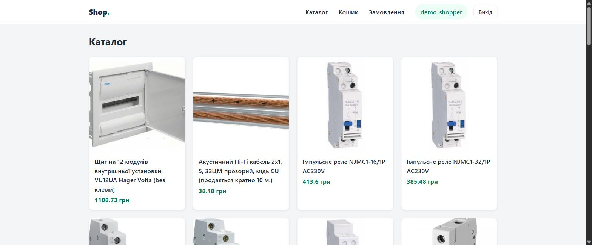
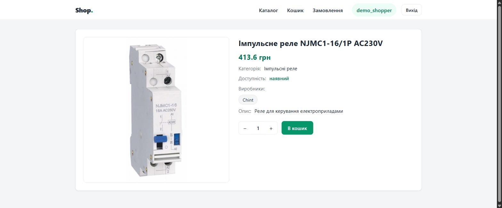
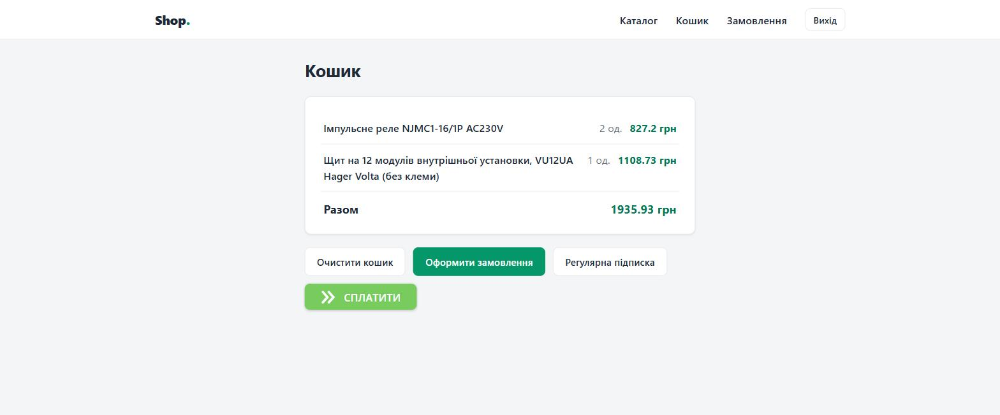
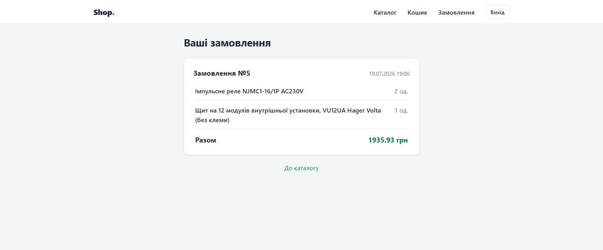
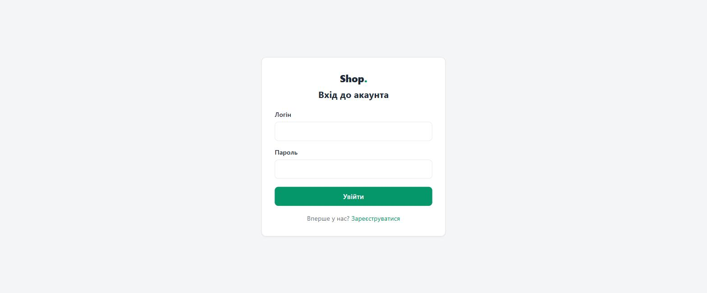
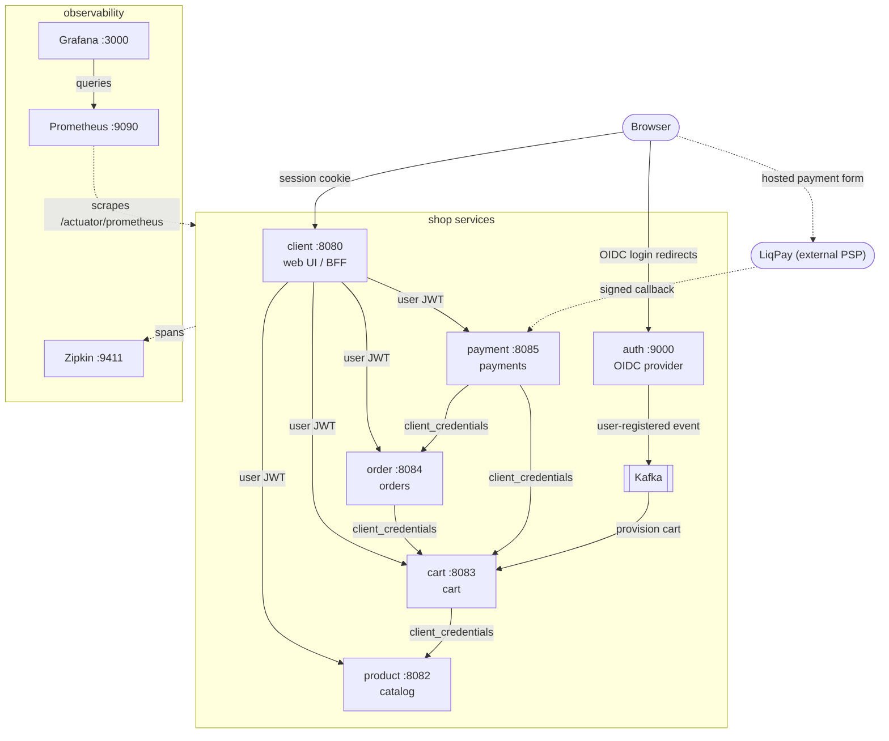
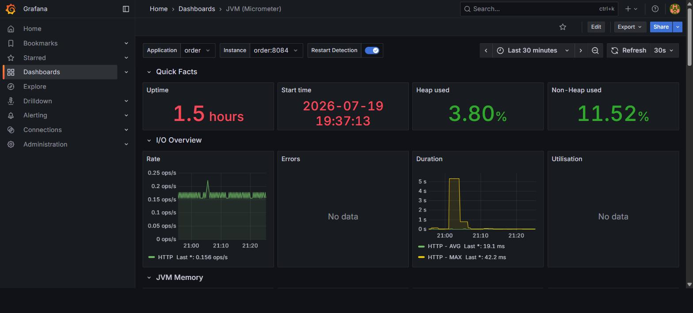
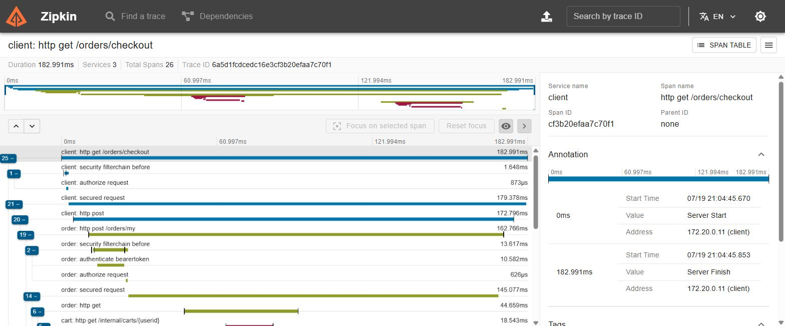

# Shop Services

[](https://github.com/vladsereda03/shop-services/actions/workflows/ci.yml)

An educational e-commerce project. Users browse a catalog, manage a cart, place orders,
pay via [LiqPay](https://www.liqpay.ua/) and set up recurring subscriptions;
administrators manage the catalog.

**Stack:** Java 21 · Spring Boot 3.5 · Spring Security / Spring Authorization Server
(OAuth2 + OIDC) · Spring Data JPA · PostgreSQL · Apache Kafka · Thymeleaf ·
springdoc-openapi (Swagger UI) · Prometheus + Grafana + Zipkin (observability) ·
Maven (multi-module monorepo).



<details>
<summary>More screenshots — product page, cart, orders, login</summary>

| | |
|---|---|
|  |  |
|  |  |

</details>

## Architecture



| Module | Port | Database | Responsibility |
|---|---|---|---|
| `services/auth` | 9000 | `authDB` | Authorization server (Spring Authorization Server): user registration, form login, OIDC provider, JWT issuing; publishes `user-registered` events to Kafka via a transactional outbox |
| `services/client` | 8080 | — | BFF / web UI (Thymeleaf): OAuth2 client, renders catalog, cart, orders, payment and subscription pages; calls the APIs below with the user's token |
| `services/product` | 8082 | `products` | Catalog: goods and manufacturers, stock reserve/release, admin-only good creation |
| `services/cart` | 8083 | `carts` | Cart REST API with stock reservation; creates a cart for each new user via Kafka |
| `services/order` | 8084 | `orders` | Orders: checkout from cart, order history, internal API for payment-driven order creation |
| `services/payment` | 8085 | `payments` | LiqPay integration: payment form, signed callbacks, subscriptions with a scheduled charge emulator |
| `libs/contracts` | — | — | Shared contracts (Kafka event payloads) |

### Security model

- End users authenticate at **auth** via OIDC (`authorization_code` + refresh
  tokens); **client** is the only OAuth2 login client and keeps tokens server-side (BFF pattern).
- Service-to-service calls use **`client_credentials`** clients (`cart-service`,
  `order-service`, `payment-service`) with fine-grained scopes
  (`products.read/write`, `carts.read/write`, `orders.write`).
- Every API service is a **resource server**: JWTs are validated against the auth
  server's JWKS. User identity travels in a custom `uid` claim, roles in an
  `authorities` claim (`ROLE_USER`, `ROLE_ADMIN`); admin endpoints require `ROLE_ADMIN`.
- LiqPay callbacks are anonymous by design and authenticated by the LiqPay
  signature (`base64(sha1(private_key + data + private_key))`) instead of tokens.

### Key flows

- **Checkout:** client → order `POST /orders/my` → order pulls the cart from cart
  service, creates the order, clears the cart without returning stock.
- **One-time payment:** cart page embeds a LiqPay form from payment → LiqPay calls
  back `POST /payment/new` → payment verifies the signature and triggers checkout
  in order.
- **Subscription:** client → payment `POST /subscriptions/my` → payment snapshots
  the cart, stores the subscription, (optionally) registers it in LiqPay and clears
  the cart; recurring charges create orders from the snapshot.

## Engineering highlights

Design decisions and production-style bugs found and fixed along the way:

1. **Hand-built OAuth2/OIDC circuit** on Spring Authorization Server — no
   Keycloak/Auth0. The UI follows the BFF pattern (`client` is the only
   browser-facing OAuth2 client; tokens never reach the browser), services call
   each other with dedicated `client_credentials` registrations and fine-grained
   scopes (see [Security model](#security-model)).
2. **Token refresh vs RP-initiated logout.** The auth server accepts only the
   *latest* ID token as `id_token_hint`, so after the first background token
   refresh, logout silently stopped working. Fixed with an event chain that
   re-injects the refreshed `OidcUser` into the live session —
   [`OidcUserSessionRefreshListener`](services/client/src/main/java/shop/client/config/OidcUserSessionRefreshListener.java).
3. **Payment callbacks are authenticated by cryptography, not tokens.** LiqPay
   cannot carry our JWTs, so the endpoint is anonymous and
   [`PaymentCallbackService`](services/payment/src/main/java/shop/payment/service/PaymentCallbackService.java)
   verifies the `base64(sha1(private_key + data + private_key))` signature before
   trusting a byte (mismatch → 403, covered by unit tests). Callbacks are
   deduplicated by LiqPay's `payment_id` at two independent layers: a guard row is
   inserted into `processed_callback` *before* the downstream call, so a concurrent
   duplicate blocks on the primary key and fails before it can create a second
   order; and order-service enforces the same key with a `UNIQUE (payment_id)` on
   `orders`, so even if that guard row is lost to a crash before it commits, the
   redelivered callback resolves to the order already created — never a duplicate
   ([`OrderService`](services/order/src/main/java/shop/order/service/OrderService.java)).
   Replays are answered `200` so the PSP stops retrying.
4. **No distributed transactions — deliberate operation ordering instead.**
   Local writes commit first, external calls go last, failures roll the local
   state back: checkout rolls the order back when the cart cannot be cleared
   ([`OrderService`](services/order/src/main/java/shop/order/service/OrderService.java)),
   subscription creation does the same around the cart snapshot
   ([`SubscriptionService`](services/payment/src/main/java/shop/payment/service/SubscriptionService.java)).
   The remaining gaps are honestly listed in
   [Known limitations](#known-limitations--roadmap).
5. **The silently-torn-traces case.** All outgoing HTTP clients were built with a
   static `RestClient.builder()`, which quietly bypasses Boot's observability
   instrumentation: no `traceparent` propagation, so every distributed trace tore
   at each service boundary. Found while wiring Zipkin; fixed by building from
   the injected auto-configured builder —
   [`RestClientConfig`](services/order/src/main/java/shop/order/config/RestClientConfig.java).
6. **The 100k-character SpEL case.** Any product image over ~75 KB crashed the
   catalog page with `EL1078E`: Thymeleaf's `+` concatenation is evaluated
   through SpEL, which caps string literals at 100k characters — base64 images
   walked right into the limit. Fixed with literal substitution (`|...|`) in
   [`goods.html`](services/client/src/main/resources/templates/assortment/goods.html).
7. **Observability paying off within the first hour.** The freshly added health
   endpoint reported auth as `DOWN`: a leftover `spring-data-redis` dependency
   had auto-registered a Redis health indicator pointing at a Redis that never
   existed. Monitoring found a dead dependency that code review had missed.
8. **Resilience on every inter-service leg.** Outgoing HTTP calls carry
   connect/read timeouts, Resilience4j circuit breakers and — on idempotent
   GETs only — retries; non-idempotent stock reservation is never retried, and
   4xx business answers (409 "insufficient stock") deliberately do not trip the
   breaker. Extracting the HTTP edges into dedicated client beans
   ([`ProductClient`](services/cart/src/main/java/shop/cart/client/ProductClient.java)
   and friends) was forced by a classic pitfall: Spring AOP proxies do not see
   self-invocation, so resilience annotations on internal methods silently do
   nothing. Breaker states are exported to Prometheus alongside the other
   metrics.
9. **One error contract across all APIs.** Every API service answers errors in
   the RFC 7807 `application/problem+json` format (`spring.mvc.problemdetails`
   plus thin `@RestControllerAdvice` relays that keep upstream problem bodies
   intact across service boundaries), and request DTOs are validated
   declaratively with Bean Validation at the MVC edge — an invalid subscription
   form or catalog entry gets a `400` problem body before any business code or
   neighbour call runs.
10. **API documentation derived from code, not written by hand.** Every API
    service serves a runtime-generated OpenAPI document and Swagger UI
    (springdoc; see [API documentation](#api-documentation)), so the docs
    cannot drift from the controllers: the Bean Validation constraints from
    highlight 9 surface as schema rules automatically, JWT auth is declared
    once as a global `bearer-jwt` scheme, and the two anonymous LiqPay
    callbacks lift that padlock with an empty `@SecurityRequirements` — the
    contract honestly shows them as signature-authenticated
    ([`PaymentController`](services/payment/src/main/java/shop/payment/controller/PaymentController.java)).
11. **Reliable event publishing through a transactional outbox.** Registration used
    to save the user and then fire the `user-registered` Kafka send as a separate
    step — a textbook dual write: a broker outage or a crash between the two lost
    the event, and the new user silently never got a cart. The event is now
    inserted into an `outbox` table in the *same* transaction as the user row
    ([`AccountService`](services/auth/src/main/java/shop/auth/service/AccountService.java);
    the write uses `Propagation.MANDATORY`, so it can only ever commit alongside a
    state change), and a scheduled
    [`OutboxPublisher`](services/auth/src/main/java/shop/auth/service/OutboxPublisher.java)
    (a `SmartLifecycle`, so polling stops cleanly on shutdown) drives an
    [`OutboxRelay`](services/auth/src/main/java/shop/auth/service/OutboxRelay.java)
    that claims rows with `FOR UPDATE SKIP LOCKED` for safe multi-instance polling
    and stamps `published_at` only after the broker ack. This closes the producer side and composes with the consumer-side
    idempotency of highlight 3: the event can no longer be lost, and a duplicate on
    retry is harmless because cart provisioning is idempotent — at-least-once, end
    to end. The recording request's trace is snapshotted into the outbox row (via
    the Micrometer `Propagator`) and resumed when the relay publishes, so the
    asynchronous hop still shows up as one continuous signup trace in Zipkin
    instead of splitting at the outbox boundary.

## Getting started

### Prerequisites

- Java 21, Maven 3.9+
- PostgreSQL on `localhost:5432` with (empty) databases `authDB`, `products`,
  `carts`, `orders`, `payments` — each service creates and versions its schema
  with [Flyway](https://flywaydb.org/) migrations on startup (`ddl-auto` is set
  to `validate`; a pre-existing database is baselined automatically)
- Docker (for Kafka and the Testcontainers-based integration tests)

### 1. Hosts entries

Services address each other and the auth server by these names (required for the
OIDC issuer to match), add to your hosts file:

```
127.0.0.1 auth.local
127.0.0.1 product.local
127.0.0.1 cart.local
```

### 2. Environment variables

| Variable | Used by | Default | Purpose |
|---|---|---|---|
| `SPRING_DATASOURCE_USERNAME` / `SPRING_DATASOURCE_PASSWORD` | all services | — (required) | PostgreSQL credentials (shared by all five databases) |
| `CLIENT_OAUTH_SECRET`, `CART_SERVICE_SECRET`, `ORDER_SERVICE_SECRET`, `PAYMENT_SERVICE_SECRET` | auth + the OAuth2 clients | dev values (e.g. `cart-service-secret`) | OAuth2 client secrets, read by both auth's registered clients and each service's own registration; override in production |
| `LIQPAY_PUBLIC_KEY` / `LIQPAY_PRIVATE_KEY` | payment | `sandbox_public_key` / `sandbox_private_key` | LiqPay merchant keys; sandbox keys from your LiqPay account are needed only to render the real payment form |
| `LIQPAY_SUBSCRIBE_ENABLED` | payment | `false` | Register subscriptions in the LiqPay API. Keep `false` with sandbox keys — the LiqPay sandbox does not support subscriptions, so the built-in scheduler emulates recurring charges instead |

### 3. Kafka

```
docker compose -f infra/docker/kafka/docker-compose.yaml up -d
```

Brokers are exposed on `localhost:29092/39092/49092`. Kafka is needed for user
registration (auth publishes an event, cart provisions the user's cart).

### 4. Build and run

```
mvn package
```

This runs the **unit** tests only (Surefire) — no Docker needed. The
Testcontainers integration tests run in a later phase, so run the full suite
with `mvn verify` (Docker required), or skip tests entirely with
`mvn package -DskipTests`.

Then start the services — auth first (the OAuth2 clients fetch its OIDC
configuration at startup), the rest in any order:

```
java -jar services/auth/target/auth-1.0-SNAPSHOT.jar
java -jar services/product/target/product-1.0-SNAPSHOT.jar
java -jar services/cart/target/cart-1.0-SNAPSHOT.jar
java -jar services/order/target/order-1.0-SNAPSHOT.jar
java -jar services/payment/target/payment-1.0-SNAPSHOT.jar
java -jar services/client/target/client-1.0-SNAPSHOT.jar
```

Open **http://localhost:8080**, register a user and log in.

For verbose local logs (SQL statements, Spring Security), activate the `dev`
profile — e.g. `SPRING_PROFILES_ACTIVE=dev java -jar ...`, or export it once for
the shell. The base configuration is production-quiet, so any unprofiled run and
the Docker Compose stack stay quiet.

### 5. Seed data

- **Manufacturers** are seeded by the `product` service's Flyway migration
  (there is no admin UI for them); to add more, create a `V2__*.sql` migration
  or insert directly into the `products` database.
- **Admin role** — grant it in `authDB` to unlock catalog management in the UI:
  ```sql
  INSERT INTO user_roles (user_id, roles)
  SELECT id, 'ADMIN' FROM users WHERE username = '<username>';
  ```
  (re-login after granting).

## Run with Docker Compose

The whole stack (PostgreSQL, a 3-broker Kafka cluster, all six services and the
Prometheus / Grafana / Zipkin observability trio) can run in containers — no
local Java, Maven or PostgreSQL needed:

```
cp .env.example .env    # fill in the JWT key pair (openssl commands inside)
docker compose up -d --build --wait
```

Then open **http://localhost:8080** (the `auth.local` hosts entry from
[Hosts entries](#1-hosts-entries) is still required — the browser is redirected
to `http://auth.local:9000` to log in; inside the compose network the same name
resolves to the auth container via a network alias, so issuer validation works
on both sides).

Notes:

- Services are configured with environment variables layered over
  `application.yaml` (see `docker-compose.yaml`); the images are built by the
  parameterized multi-stage `Dockerfile` in the repository root.
- The LiqPay callback emulator works against the containerized stack as well:
  payment is published on `localhost:8085`.
- To grant the admin role inside the container database:
  `docker exec shop-postgres psql -U shop -d authDB -c "INSERT INTO user_roles ..."`.
- The full stack and the standalone Kafka cluster
  (`infra/docker/kafka/docker-compose.yaml`, used for host-mode development)
  define the same containers — run one or the other, not both.
- Stop everything with `docker compose down` (add `-v` to also drop the
  database volume and start fresh next time).

## Observability

Every service exposes health probes and metrics via Spring Boot Actuator +
Micrometer: `/actuator/health` (used by the compose healthchecks) and
`/actuator/prometheus` are open anonymously, the rest of the management
surface stays closed. The compose stack ships the monitoring/tracing trio:

| Tool | URL | Purpose |
|---|---|---|
| Prometheus | http://localhost:9090 | scrapes `/actuator/prometheus` of all six services every 15s (`infra/docker/prometheus/prometheus.yml`); targets carry an `application` label |
| Grafana | http://localhost:3000 (`admin`/`admin`) | Prometheus datasource provisioned from `infra/docker/grafana/provisioning`; import dashboard `4701` (JVM Micrometer) and switch services via the `application` variable |
| Zipkin | http://localhost:9411 | distributed trace storage and UI |



Distributed tracing uses Micrometer Tracing with the Brave bridge: spans cover
incoming HTTP, outgoing `RestClient` calls and the Kafka leg (auth → cart);
the W3C `traceparent` header propagates the trace across service boundaries,
and spans are reported to Zipkin (100% sampling — a demo setting; production
would sample a few percent). A checkout shows up as a single
client → order → cart waterfall (adding an item to the cart traces
client → cart → product through the stock reservation). Logs carry a
`[service,traceId,spanId]` prefix, so a trace found in Zipkin can be grepped
across `docker logs` of any service.



In host mode the metrics endpoints work as-is and spans are sent to
`http://localhost:9411` — start the Zipkin container if traces are wanted; a
missing Zipkin is harmless (spans are dropped with a warning).

## API documentation

Each API service generates a live OpenAPI 3 document from its controllers at
runtime ([springdoc-openapi](https://springdoc.org/)) and serves an interactive
Swagger UI:

| Service | Swagger UI (host mode) | OpenAPI document |
|---|---|---|
| product | http://localhost:8082/swagger-ui.html | http://localhost:8082/v3/api-docs |
| cart | http://localhost:8083/swagger-ui.html | http://localhost:8083/v3/api-docs |
| order | http://localhost:8084/swagger-ui.html | http://localhost:8084/v3/api-docs |
| payment | http://localhost:8085/swagger-ui.html | http://localhost:8085/v3/api-docs |

The **Authorize** button accepts a bearer access token (user token or a
`client_credentials` token for the internal endpoints), so requests can be
executed straight from the browser. In the compose stack only payment's port is
published to the host — the other services' documentation stays reachable from
inside the compose network only, matching the deliberately minimal exposed
surface (9000/8080/8085).

## Tests

Unit and integration tests are split across Maven's phases: unit tests run in
`test` (Surefire), integration tests (named `*IT`) run in `integration-test` /
`verify` (Failsafe).

```
mvn test      # unit tests only — fast, no Docker
mvn verify    # unit + integration tests (Docker required)
```

- **Unit tests** (no infrastructure needed): LiqPay callback processing in
  `payment` (signature verification, duplicate callbacks, status handling),
  subscription creation ordering and rollback in `payment`, catalog validation
  and stock reserve/release in `product`.
- **Integration tests** (`*IT`, require Docker): full Spring context against real
  PostgreSQL and Kafka started by [Testcontainers](https://testcontainers.com/),
  with the neighbour services stubbed at the HTTP level:
  - `auth` — registration persists the user and writes the `user-registered`
    event to a transactional outbox, which the scheduled publisher relays to the
    real Kafka broker and stamps published; an outbox write outside a transaction
    is rejected. Plus token issuing and JWKS smoke tests.
  - `cart` — Kafka-driven cart provisioning, stock reservation with transaction
    rollback on conflict, resource-server security rules.
  - `order` — checkout turns the cart into an order and rolls back when the
    cart cannot be cleared; scope-protected internal API.
  - `payment` — subscription snapshot persistence and rollback, the recurring
    charge query, anonymous LiqPay callbacks with signature enforcement.
  - `product` — concurrent stock reservation against the pessimistic row lock
    (no overselling), role/scope authorization including the custom JWT
    authorities converter.

## Testing LiqPay locally

The payment callback URL (`http://localhost:8085/payment/new`) is not reachable
from the internet, so callbacks are emulated with a script that builds a properly
signed request:

```powershell
./scripts/emulate-liqpay-callback.ps1 -UserId 1            # successful payment
./scripts/emulate-liqpay-callback.ps1 -UserId 1 -BadSignature   # must be rejected with 403
./scripts/emulate-liqpay-callback.ps1 -UserId 1 -Status failure # accepted, no order created
```

The script and the payment service share the sandbox key defaults, so real LiqPay
keys are not required for callback testing.

Recurring subscription charges are emulated by scheduled jobs in the payment
service (`task.cron.*` in `services/payment/src/main/resources/application.yaml`,
default: daily/weekly/monthly/yearly at 15:00).

## Known limitations & roadmap

- No distributed transactions between services: operation ordering minimizes the
  damage window (local writes first, external calls last). The auth → cart
  `user-registered` event is now delivered through a transactional outbox
  (highlight 11), but the checkout and payment flows still rely on ordering
  alone; sagas with compensation there are future work.
- Secrets come from the environment — DB credentials, the JWT signing keys, LiqPay
  keys and the OAuth2 client secrets — with dev defaults baked in for a one-command
  local run and overridable in production. The committed dev defaults are demo
  credentials, not real ones.
- Planned next: Kubernetes manifests, an API gateway.

## Repository layout

```
libs/contracts/           shared event contracts
services/<name>/          one Spring Boot app per service
infra/docker/kafka/       Kafka cluster for local development
infra/docker/prometheus/  Prometheus scrape configuration
infra/docker/grafana/     Grafana provisioning (datasource)
scripts/                  development utilities (LiqPay callback emulator)
docs/images/              README screenshots
```
